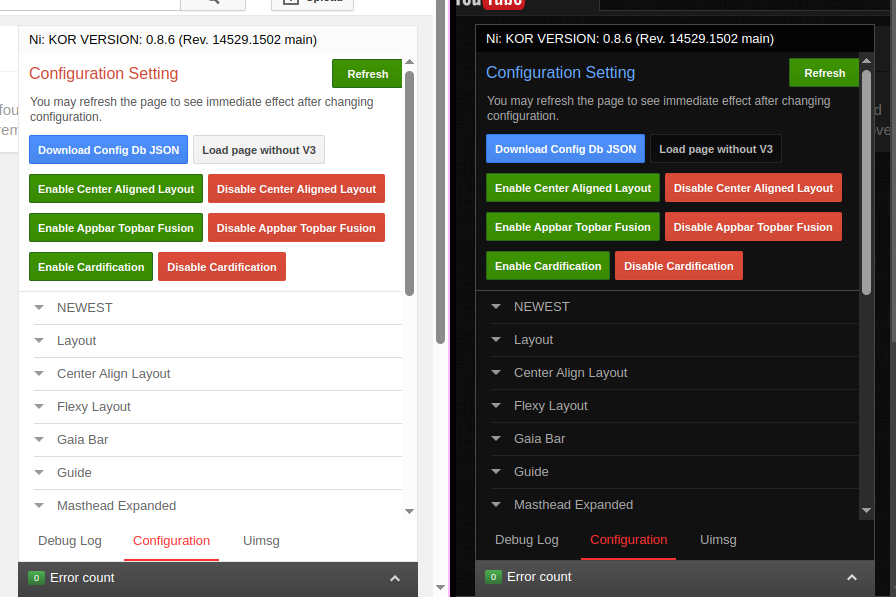

my personal tweakity stuff for [Vorapis 2013](https://vorapis.pages.dev), published for others to use!

### semi-better theater mode [[userstyle]](https://github.com/macimas/stylin/raw/main/v3/semi-better_theater_mode/v3.user.css)
an attempt to make theater mode act more like in modern YouTube
 
somewhat configurable

it also works with StarTube at least when i tried it with most layouts, altho i don't really use it `:p`

### semi-better vordebugger [[userstyle]](https://github.com/macimas/stylin/raw/main/v3/semi-better_vordebugger/v3.user.css)
an attempt to improve the vordebugger, with my personal preference
 
it's a bit iffy, but should be good enough (for me at the very least)

### dark mode for StarTube [[userstyle]](https://github.com/macimas/stylin/raw/main/v3/dark_mode_for_StarTube/v3.user.css)
a messy attempt to add dark mode for StarTube's layouts + very minor tweaks

<table>
	<tr>
		<th colspan="3">Epic Panda</th>
	<tr>
	<tr>
		<td></td>
		<td></td>
		<td></td>
	</tr>
	<tr>
		<th colspan="3">Cosmic Panda</th>
	<tr>
	<tr>
		<td></td>
		<td></td>
		<td></td>
	</tr>
	<tr>
		<th colspan="3">2014 (alt watch9)</th>
	<tr>
	<tr>
		<td></td>
		<td></td>
		<td></td>
	</tr>
	<tr>
		<th colspan="3">2017 (alt watch9)</th>
	<tr>
	<tr>
		<td></td>
		<td></td>
		<td></td>
	</tr>
</table>

### clear button for search bar [[userscript]](https://github.com/macimas/stylin/raw/main/v3/clear%20button%20for%20search%20bar.user.js)
probably dirty attempt to add a button to clear search bar
 
it works most of the time

### toggle theater with key [[userscript]](https://github.com/macimas/stylin/raw/main/v3/toggle%20theater%20with%20key.user.js)
little script where u press T and you toggle theater mode! so cool!!!!!!

### v1 semi-better theater mode [[userstyle]](https://github.com/macimas/stylin/raw/main/v3/v1%20semi-better%20theater%20mode.css)
first version of the "semi-better theater mode" userstyle. its quite bad. would go on to work on v2 a day later