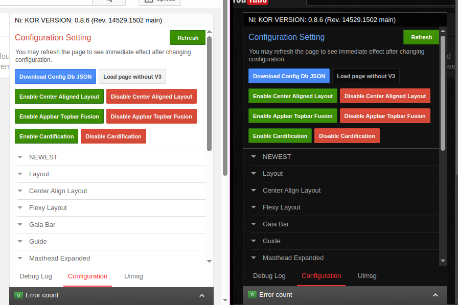

my personal css stuff for [v3](https://vorapis.pages.dev)

### semi-better theater mode.css
an attempt to make theater mode act more like in modern YouTube
 
somewhat tweakable with some variables in `:root`

it also works with StarTube at least when i tried it with most layouts, altho i don't really use it `:p`

### semi-better vordebugger.css
an attempt to improve the vordebugger, with my personal preference
 
it's a bit iffy, but should be good enough (for me at the very least)

